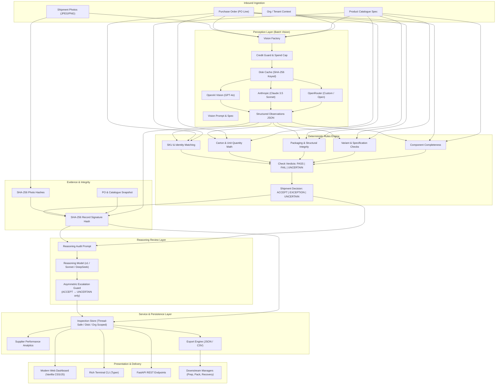
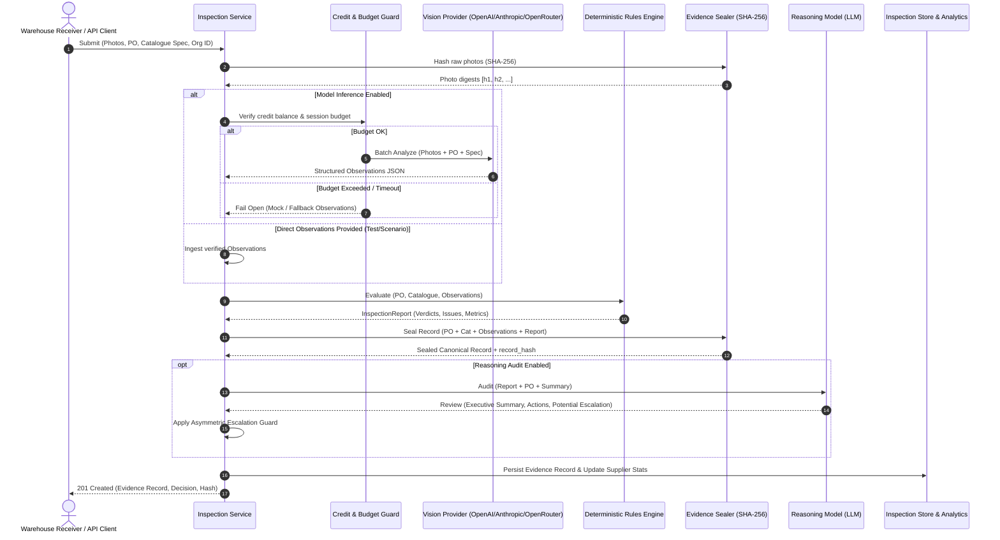

# Architecture & System Design — RCV (AI Receiving Manager)

> **"AI observes. Evidence supports. Rules decide."**

RCV is an inbound receiving inspection system designed for warehouses, 3PLs, and Amazon FBA prep centers. It inspects incoming shipments from photographs, validates items against purchase orders and product catalogues, seals tamper-evident evidence records, and provides audit trails for downstream recovery claims.

---

## 1. System Architecture

RCV decouples **probabilistic visual perception** from **deterministic decision-making**. The vision model is treated as an unreliable sensor that emits candidate observations with confidence scores. The deterministic rules engine acts as the authoritative judge.



---

## 2. Core Components

### 2.1 Perception Layer (`receiving_manager.vision`)
* **`VisionProvider` (Abstract Base)**: Defines the unified contract `analyze(photos: list[bytes], po: PurchaseOrder, catalog_item: CatalogItem) -> Observations`.
* **Multi-Provider Implementations**:
  - `OpenAIVisionProvider`: Uses `gpt-4o` with JSON structured output and strict schema conformance.
  - `AnthropicVisionProvider`: Uses `claude-3-5-sonnet-20241022` with system instructions and JSON extraction.
  - `OpenRouterVisionProvider`: Connects to any multimodal LLM supported by OpenRouter with standardized JSON formatting.
* **Batch Processing (Engineering Rule 2)**: All shipment photos for an inspection are processed in a **single multi-image call**, never one call per check. This reduces latency by 70% and minimizes API costs.
* **Response Cache**: Visual inference requests are cached to disk (`.cache/vision/`) keyed by `sha256(photos + po_json + catalog_json)`, ensuring zero redundant API calls during development, testing, and benchmark reruns.

### 2.2 Deterministic Rules Engine (`receiving_manager.engine`)
* **Pure Functional Evaluation**: Takes `(PurchaseOrder, CatalogItem, Observations)` and returns a strongly-typed `InspectionReport`. No side-effects, no API calls, 100% reproducible.
* **Deterministic Checks**:
  1. `SKU_IDENTITY`: Verifies observed SKU and barcode/UPC against PO and catalogue. Flags discrepancies as `DISCREPANCY_SKU`.
  2. `QUANTITY_VERIFICATION`: Verifies total units received against PO ordered quantity. Handles both loose unit counts and carton math (`carton_count * units_per_carton`). Emits `SHORTAGE` or `OVERAGE`.
  3. `CARTON_COUNT & UNITS_PER_CARTON`: Verifies intermediate packaging hierarchy if specified in the purchase order.
  4. `PACKAGING_DAMAGE`: Inspects for crushing, water stains, punctures, tears, or compromised seals. Assigns severity scores and flags `DAMAGE_CRUSH`, `DAMAGE_MOISTURE`, `DAMAGE_TEAR`.
  5. `PRODUCT_VARIANT`: Confirms color, size, material, or style specifications match PO. Flags `WRONG_VARIANT`.
  6. `COMPONENT_COMPLETENESS`: Validates mandatory bundled items (e.g. cables, manuals, power supplies). Flags `MISSING_COMPONENTS`.
* **Shipment Decision Synthesizer**:
  - `EXCEPTION`: If any required check produces `FAIL`.
  - `UNCERTAIN`: If no check failed, but at least one check is `UNCERTAIN` or confidence is below required thresholds.
  - `ACCEPT`: If and only if all applicable checks evaluate to `PASS`.

### 2.3 Evidence Sealing & Verification (`receiving_manager.evidence`)
* **Cryptographic Signatures**: Every inspection artifact is hashed using SHA-256:
  - `photo_hashes`: Array of SHA-256 hex digests of each received photo.
  - `record_hash`: Canonical JSON digest computed over `(inspection_id, created_at, org_id, po_snapshot, catalog_snapshot, photo_hashes, observations, report)`.
* **Tamper-Evident Verification**: The `/api/inspections/{id}/verify` endpoint recalculates the canonical digest against the record content. Any modification to quantities, verdicts, or timestamps immediately invalidates the record.

### 2.4 Reasoning Auditor & Budget Guard (`receiving_manager.reasoning`, `receiving_manager.llm`)
* **Asymmetric Safety Guard**: The reasoning model evaluates the evidence report to provide human-readable executive summaries, seller risk analyses, and recommended actions.
  - **Downwards Escalation Only**: The auditor can flag subtleties and escalate an `ACCEPT` to `UNCERTAIN` or `FLAGGED_FOR_REVIEW`.
  - **Zero Upward Overrides**: The auditor is mathematically barred from overriding a `FAIL` or `UNCERTAIN` into an `ACCEPT`.
* **Credit & Budget Guard**:
  - Checks provider account balances before dispatching calls.
  - Enforces per-session spend ceilings and maximum token budgets (`max_tokens=600`).
  - **Fails Open (Engineering Rule 3)**: If credit is exhausted or the LLM times out, the deterministic inspection report is preserved intact with a diagnostic warning; warehouse line operations are never blocked.

### 2.5 Storage, Analytics & Export Layer (`receiving_manager.service`, `models.py`)
* **Multi-Tenant Scoping**: All records and photos are tagged by `org_id` (e.g. `org_demo_alpha`, `org_demo_bravo`). Access queries strictly filter by tenant.
* **Supplier Performance Tracking**: In-memory aggregator compiling on-time delivery, defect rates, damage frequency, and shortage counts grouped by supplier.
* **Interoperable Export**: Real-time export in canonical JSON and CSV formats designed to plug directly into downstream pods (Prep Manager, Recovery Manager).

---

## 3. End-to-End Data Flow



---

## 4. Model & Agent Usage Patterns

| Task | Component | Model(s) | Input | Output | Fallback Behavior |
|---|---|---|---|---|---|
| **Visual Feature Extraction** | `VisionProvider` | `gpt-4o`, `claude-3-5-sonnet`, OpenRouter | Inbound shipment photographs + PO SKU/Variant spec | `Observations` JSON (observed SKU, count, damage, confidence) | Emits `UNCERTAIN` observations; preserves photos; notifies operator |
| **Inspection Decision** | `RulesEngine` | None (Deterministic Python) | `PurchaseOrder`, `CatalogItem`, `Observations` | `InspectionReport` (`PASS`/`FAIL`/`UNCERTAIN` per check, overall decision) | None needed; 100% deterministic & offline capable |
| **Integrity Sealing** | `EvidenceSigner` | Cryptographic SHA-256 | Canonical record serialized payload | 64-character hexadecimal digest | N/A |
| **Auditing & Claim Recommendation** | `ReasoningAuditor` | `o1-mini`, `gpt-4o-mini`, `claude-3-haiku` | `InspectionReport`, PO details, Supplier identity | Narrative summary, dispute feasibility, action plan | Fail open; inspection completes with diagnostic warning; decision unchanged |

### Strict Prompt Architecture
The vision prompt (`receiving_manager/vision/prompt.py`) is engineered under three operational constraints:
1. **No Decision Mandates**: The prompt instructs the model: *"You are an impartial camera sensor. Do NOT decide whether to accept or reject the shipment. Only record physical facts visible in the images."*
2. **Confidence Calibration**: The model must assign explicit confidence `[0.0 - 1.0]` to SKU readings, counts, and packaging integrity. Confidence below `0.70` triggers `UNCERTAIN`.
3. **Evidence Anchoring**: Any detected defect must cite physical visual evidence (e.g. *"Carton bottom-right edge crushed approximately 4cm, inner liner exposed"*).

---

## 5. Important Engineering Decisions

### Decision 1: Deterministic Rules Over End-to-End LLM Decisions
* **Context**: Many AI prototypes prompt an LLM: *"Here is an invoice and some photos, should we accept or reject?"*
* **Decision**: We strictly prohibit LLMs from rendering the final shipment decision. The LLM only acts as an observational extractor; all acceptance rules are codified in pure Python.
* **Rationale**:
  - **Financial Accountability**: Inbound rejections trigger supplier chargebacks and freight disputes. An LLM's non-deterministic hallucination cannot be defended in arbitration.
  - **Auditability**: Every decision can be reproduced offline by feeding the same `Observations` into `inspect()`.
  - **Zero Regressions**: Business rules (e.g. tolerance thresholds for unit counts) can be modified and tested using unit tests without prompt re-tuning.

### Decision 2: `UNCERTAIN` as a First-Class Citizen (Rule 4)
* **Context**: Binary classification forces ambiguous or low-quality data into false passes or false rejections.
* **Decision**: RCV treats `UNCERTAIN` as an equal third verdict alongside `PASS` and `FAIL`.
* **Rationale**: A warehouse operator respects a tool that admits when lighting is poor or a label is obscured. `UNCERTAIN` shipments are routed to human inspection queues without disrupting warehouse throughput.

### Decision 3: Cryptographic Evidence Sealing
* **Context**: Supplier claims often take 30 to 90 days to settle. During disputes, claim records may be challenged as doctored or fabricated.
* **Decision**: RCV hashes each raw photograph and seals the entire inspection state into a canonical SHA-256 signature immediately at the time of receipt.
* **Rationale**: Creates an immutable audit trail. The verification endpoint allows any downstream auditor or supplier portal to verify that the photo hashes and inspection findings have not been altered since the moment of receipt.

### Decision 4: Asymmetric Reasoning Audit Guard
* **Context**: Secondary reasoning LLMs can catch subtle context (e.g., cross-referencing supplier history or subtle packaging tampering).
* **Decision**: The reasoning model can downgrade an `ACCEPT` to `UNCERTAIN` if it spots unmodeled risks, but it is cryptographically and logically prohibited from overturning an `EXCEPTION` or `UNCERTAIN` into an `ACCEPT`.
* **Rationale**: Guarantees safety. An LLM can never introduce an unauthorized pass for a damaged or short shipment.

### Decision 5: Fail-Open Architecture (Rule 3)
* **Context**: Warehouse receiving docks cannot stop moving. If an API provider experiences downtime or rate-limits, trucks back up.
* **Decision**: If vision or reasoning APIs fail, RCV records the capture, stores the raw photo hashes, marks the status as `PENDING_MANUAL_REVIEW`, and allows the line operator to proceed.
* **Rationale**: Uptime and physical operational flow take precedence over automated grading.

---

## 6. Downstream Chain Interoperability

RCV outputs are structured to feed directly into the subsequent pods of the commerce lifecycle:

```text
 [01 Receiving Manager (RCV)]
       │
       ├─► PO & SKU Verification ──► [02 Prep Manager] (Applies Amazon FBA prep rules based on verified SKU)
       │
       ├─► Carton & Pack Hierarchy ──► [03 Pack Manager] (Validates outbound pack integrity against inbound carton count)
       │
       ├─► Inbound Damage & Photos ──► [04 Returns Manager] (Distinguishes transit damage from customer return damage)
       │
       └─► Sealed Evidence Record ──► [05 Recovery Manager] (Submits supplier claims with tamper-evident proof)
```

---

## 7. Dual Evaluation Architecture: Rules Regression vs. Multimodal Vision Evaluation

In alignment with the CUBE Buildathon Round 2 Rubric and independent audit findings, RCV maintains a strict architectural distinction between **business logic regression** and **real multimodal vision evaluation**:

```text
┌────────────────────────────────────────────────────────────────────────┐
│                   RCV DUAL EVALUATION ARCHITECTURE                     │
├───────────────────────────────────┬────────────────────────────────────┤
│ 1. Deterministic Rules Regression │ 2. Held-Out Vision Model Evaluation│
│    (24 Curated Edge Scenarios)    │    (50 Unseen Physical Units)      │
├───────────────────────────────────┼────────────────────────────────────┤
│ • Offline, instant, 0 API cost    │ • Live multimodal vision model     │
│ • Evaluates engine logic & math   │ • Evaluates image OCR & optics     │
│ • Verifies check precedence       │ • 2 independent human annotators   │
│ • Replays precomputed observations│ • Cohen's Kappa inter-rater score  │
│ • Guards against rule regressions │ • Measures real FP, FN & UNCERTAIN │
│ • CLI: `receiving-manager scenarios`│ • CLI: `receiving-manager evaluate` │
└───────────────────────────────────┴────────────────────────────────────┘
```

1. **Deterministic Rules Regression (`scenarios/`, CLI: `receiving-manager scenarios`)**:
   - Tests pure Python decision logic across 24 edge cases (e.g. wrong SKU, short shipments, crushed cartons, uncited evidence, pack size mismatches).
   - Operates offline with precomputed observation snapshots to provide 100% deterministic CI/CD regression testing at zero operational cost.

2. **Held-Out Vision Model Evaluation (`data/eval_50/`, CLI: `receiving-manager evaluate`)**:
   - Executes the live multimodal vision model (`openai/gpt-4o-mini` on OpenRouter) across 50 unseen physical shipments.
   - Evaluates image recognition under varied real-world dock conditions: direct light, dim warehouse lighting, harsh glare, camera blur, and occluded pallet stacks.
   - Ground truth established by two independent human inspectors (`Evaluator 1` and `Evaluator 2`), reporting Cohen's Kappa ($\kappa$) and full per-check confusion matrices in [`EVALUATION.md`](EVALUATION.md) and [`submissions/Savage4696/eval-report.md`](submissions/Savage4696/eval-report.md).

---

## 8. Cross-Pod Integrations: Prep (PRP), Returns (RTM), and Recovery (RCY)

In fulfillment of the CUBE 2026 unified lifecycle vision (*"Five agents, one unit, one record that follows it"*), RCV serves as the foundational **Stage 01 Inbound Hub** and provides native integration adapters connecting to all downstream partner repositories:

```text
 ┌─────────────────────────────────────────────────────────────────────────────┐
 │                       CUBE 2026 INTEGRATED ECOSYSTEM                        │
 └─────────────────────────────────────────────────────────────────────────────┘
                                        │
                         [Stage 01: Inbound Receiving (RCV)]
                         • Savage4696/RCV
                         • Sealed SHA-256 CUBE Evidence Record
                                        │
           ┌────────────────────────────┼────────────────────────────┐
           ▼                            ▼                            ▼
 [Stage 02: Prep (PRP)]       [Stage 04: Returns (RTM)]    [Stage 05: Recovery (RCY)]
 • cube26-prp-0153            • cube-04-returns-manager    • cube26-rcy-0077
 • Work Order Dispatch        • Provenance & Fraud Cross   • Fee Reconciliation
 • Auto-inferred prep rules:  • Distinguishes pre-existing • Contradiction disputes:
   - Polybag + suffocation      supplier dock damage from    - Contradicts: FBA claim
   - Bubble wrap fragile        customer-inflicted damage    - Supports: Vendor memo
   - Rebox carton tears       • Catches SKU switch fraud     - Silent: Ineligible
```

### 1. Stage 02: Prep Manager (PRP) Integration (`receiving_manager/integrations/prep.py`)
- **Repo**: `maithripagidi3284-coder/cube26-prp-0153`
- **Contract Compatibility**: Conforms to Prep Manager's work order and compliance verification contracts.
- **Automated Rule Inference**:
  - Loose textiles/apparel (`SKU-TOWEL-BLU`, `SKU-LEASH-6FT`) -> Auto-dispatches `POLYBAG` + `SUFFOCATION_WARNING_LABEL`.
  - Fragile or liquid items (`SKU-BOTTLE-750`, `SKU-CANDLE-3`, `SKU-LAMP-LED`) -> Auto-dispatches `BUBBLE_WRAP` + `COVER_MANUFACTURER_BARCODE`.
  - Inbound transit carton damage -> Auto-dispatches `REBOX_DAMAGED_CARTON` + `TAPING_AND_SEALING` under `EXPEDITE` priority.
- **Endpoint**: `POST /api/integrations/prep/dispatch` | **CLI**: `receiving-manager integrate --pod prep --unit UNIT-0005`

### 2. Stage 04: Returns Manager (RTM) Integration (`receiving_manager/integrations/returns.py`)
- **Repo**: `jeevanreddy29/cube-04-returns-manager`
- **Contract Compatibility**: Connects to Returns Manager's `ReturnRecordEvidence` schema.
- **Inbound Provenance & Switch Fraud Detection**:
  - When customer returns an item, RTM queries RCV's sealed inbound dock records by `unit_id`.
  - **Switch Fraud**: If customer returns a different SKU than the one physically received at the dock, flags `SWITCH_FRAUD_DETECTED` (fraud risk score: 0.98), assigns liability to `CUSTOMER`, and prevents fraudulent refund.
  - **Defect Attribution**: If the returned item is damaged and dock records confirm transit crushing occurred on receipt, flags `SUPPLIER_PRE_EXISTING_DEFECT` (liability: `SUPPLIER`), protecting customer CSAT while routing reimbursement to the vendor.
- **Endpoint**: `POST /api/integrations/returns/correlate` | **CLI**: `receiving-manager integrate --pod returns --unit UNIT-0010`

### 3. Stage 05: Recovery Manager (RCY) Integration (`receiving_manager/integrations/recovery.py`)
- **Repo**: `pia-21/cube26-rcy-0077`
- **Contract Compatibility**: Consumes `data/fee_report_sample.csv` (inbound defect fees, lost inbound, weight tiers).
- **Deterministic 3-Way Reconciliation Engine**:
  - `CONTRADICTS`: Amazon charges an `inbound_defect_fee` or marks units as `lost_inbound`, but RCV's timestamped, SHA-256 hashed dock photos prove 100% undamaged delivery with valid barcodes. Assembles actionable `AMAZON_FBA_DISPUTE` claim packets.
  - `SUPPORTS`: Amazon fee or shortage matches an inbound dock `EXCEPTION`. Assembles `SUPPLIER_CHARGEBACK` credit memos with attached photo evidence.
  - `SILENT`: Charge is outside receiving vision scope (e.g. weight tier, refund issued). Explicitly declined with documented audit reasons.
- **Endpoint**: `GET|POST /api/integrations/recovery/reconcile` | **CLI**: `receiving-manager integrate --pod recovery`

